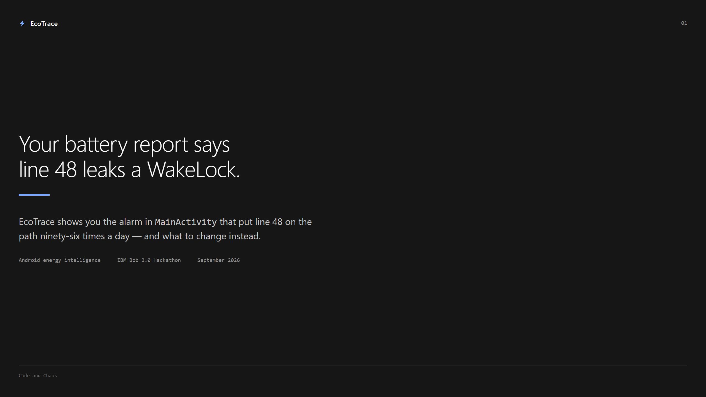
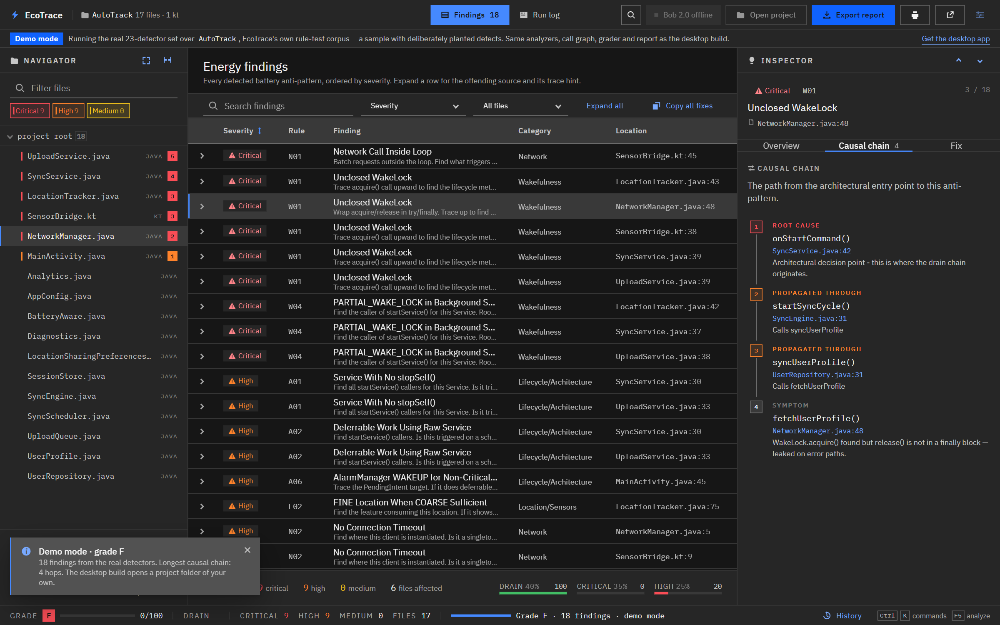
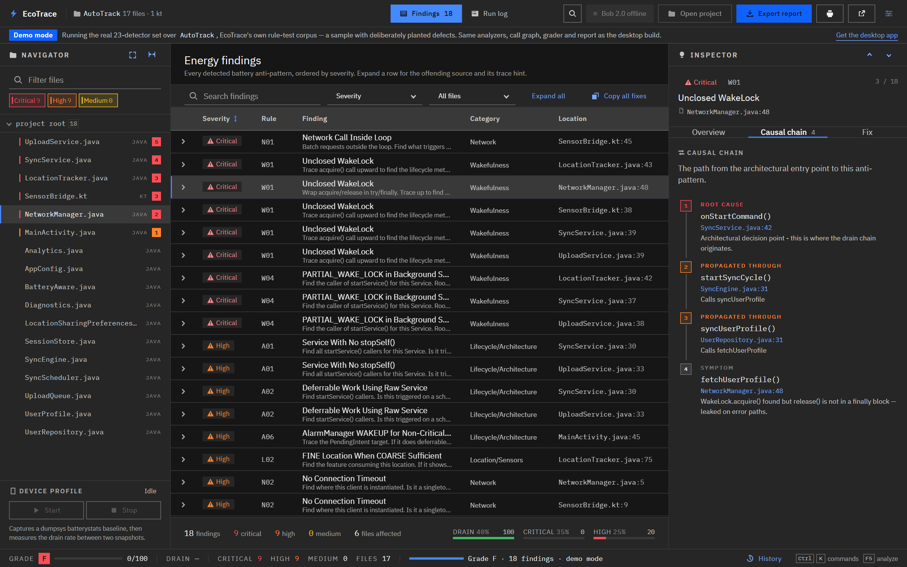
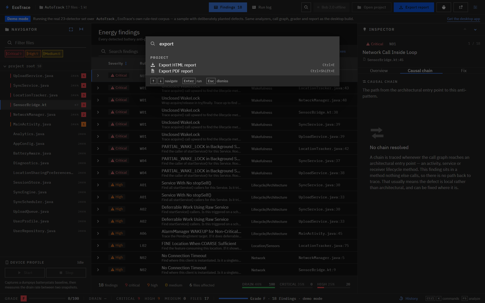
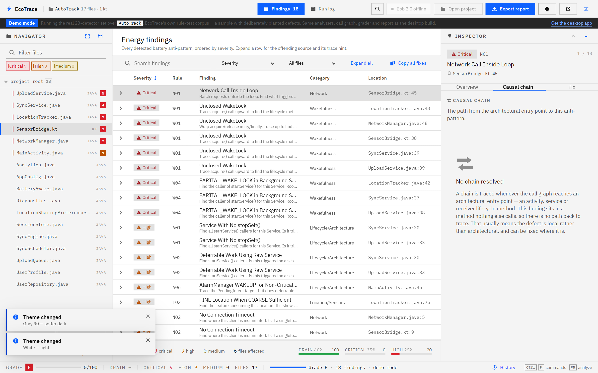
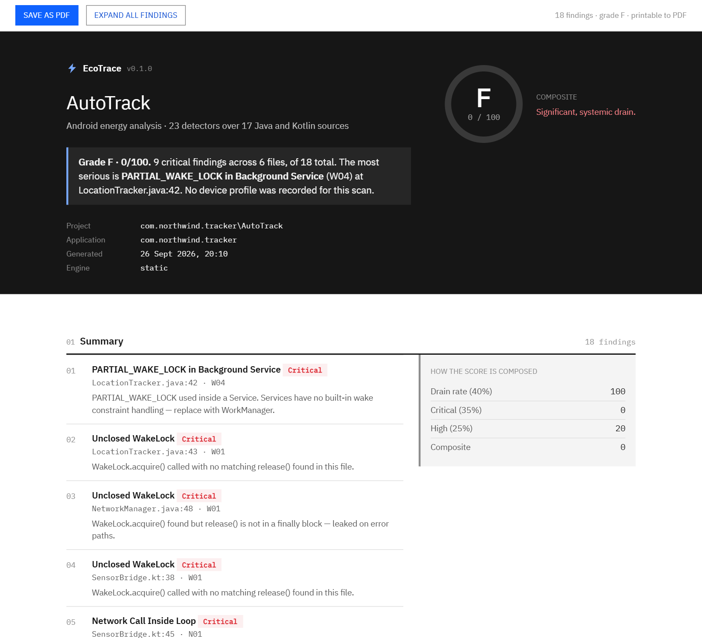
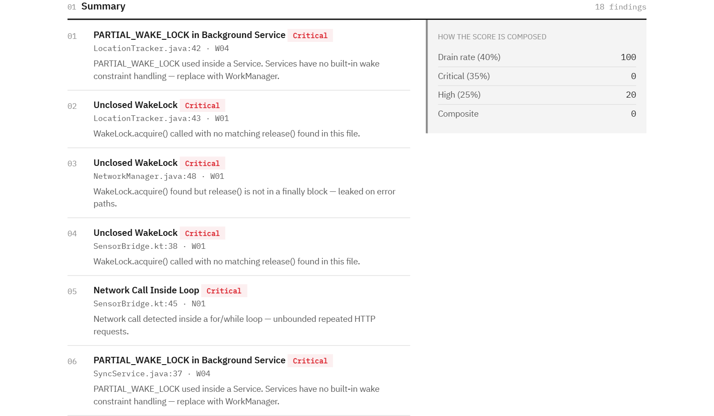
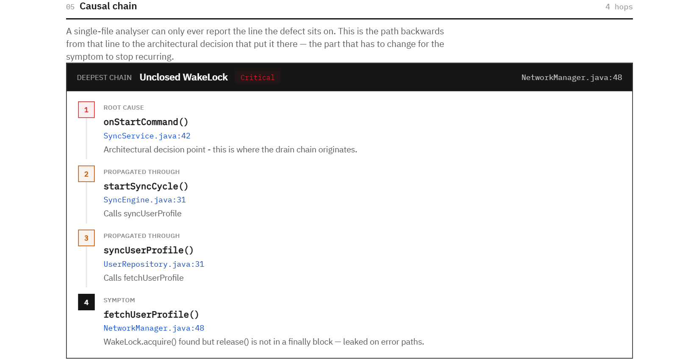
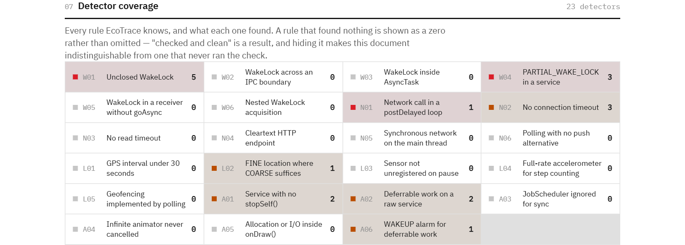

<div align="center">


# EcoTrace

### Android Energy Intelligence Platform

> **The first tool that does not just find battery drain -- it finds *why* your code architecture causes it.**

<br/>

[](https://bob.ibm.com)
[](https://tauri.app)
[](https://typescriptlang.org)
[](https://www.rust-lang.org)
[](LICENSE)
[](https://github.com/theredhacker0345/Eco-Trace/releases)

<br/>

[](https://lablab.ai/ai-hackathons/ibm-bob-2-hackathon)
[](https://lablab.ai/u/@theredhacker0345)

<br/>



<br/>

<p align="center">
  
</p>

<p align="center"><sub>
The hosted demo, unmodified. It opens on the deepest chain in the scan rather than the
first finding, because the chain is the reason the tool exists. Click the tree to scope the
table, the tabs to switch between rule, chain and fix, or <b>Export report</b> for the PDF.
</sub></p>

<br/>

[Download EXE](https://github.com/theredhacker0345/Eco-Trace/releases) &nbsp;|&nbsp;
[Live demo](#live-demo) &nbsp;|&nbsp;
[Screenshots](#screenshots) &nbsp;|&nbsp;
[Build from Source](#build-from-source) &nbsp;|&nbsp;
[How It Works](#how-it-works) &nbsp;|&nbsp;
[The Report](#the-report) &nbsp;|&nbsp;
[Business](#business) &nbsp;|&nbsp;
[Setup Guide](SETUP.md)

</div>

<br/>

---

## The Problem

Every Android battery tool on the market -- Battery Historian, Android Profiler, even Google's own tools -- tells you **what** is draining your battery.

**None of them tell you why.**

"Why" requires understanding how a single architectural decision in `MainActivity.java` propagates through six layers of your codebase to cause a GPS drain reported in `dumpsys`. That is not a pattern matching problem. That is a reasoning problem -- and only one tool on the planet can solve it at the repository scale.

```
MainActivity.onCreate()
  -> AlarmManager.setRepeating()          <- wakes device every 15 min
    -> SyncService.onStartCommand()
      -> UserRepository.sync()
        -> NetworkManager.fetchUserData() <- no timeout set
          -> LocationService.getLastKnown()
            -> GPS.requestSingleUpdate()  <- FINE accuracy, 3x battery cost
```

No linter sees this chain. No retrieval-based AI sees this chain.

EcoTrace traces it in **two tiers**, and this distinction matters:

| Tier | Runs | Needs a key? | What it contributes |
|---|---|:---:|---|
| **Local call-graph tracer** | Always, on every scan | No | Builds a real cross-file call graph from the sources and walks back from each finding to the lifecycle entry point that put it there. Works offline, costs nothing, is reproducible. |
| **IBM Bob 2.0** | Only if you paste a key | Yes | Holds the whole repository in one reasoning pass, so it can revise a severity, correct a description, and write a fix written *against that specific chain* — including for defects the local pass attributed to the wrong method. |

The local tracer is what makes the feature work for everyone. Bob is what makes
it sharper. A tool that only works when you hand it an API key is a demo, so the
chain, the grade, the history and the whole report are all produced with Bob
switched off.

---

## Why two tiers -- and what each one is for

Bob is how the tool was *built*. It is not what the tool *depends on*. Those are
different claims and the distinction is the point.

| Tier | Runs | Needs a key? | What it contributes |
|---|---|:---:|---|
| **Local call-graph tracer** | On every scan, in every build | No | 23 detectors and a real cross-file call graph. Runs offline, costs nothing, is reproducible. The demo and the hosted build use only this. |
| **IBM Bob 2.0** | Only if you paste a key | Yes | Holds the whole repository in one reasoning pass, so it can revise a severity, correct a description, and write a fix written *against that specific chain*. |

The 23 detectors and the call-graph builder are the output of the Bob sessions
recorded in [`/bob_sessions`](bob_sessions/README.md). A tool that only works
when you hand it an API key is a demo, so the chain, the grade, the history and
the entire report are all produced with Bob switched off.

**A note on the claim this replaced.** An earlier version of this README said
that no other tool could trace these chains, and that the local tracer was
impossible. Both were wrong, and the local tracer shipped. What can honestly be
said is narrower and more useful: a *call graph* over a whole repository is not
something a per-file linter has, and holding the whole repository in one
reasoning pass is not something a call graph has. EcoTrace does the first
natively and uses the second when it is available.

---

## How It Works

### 1. Static Analysis -- 23 Energy Anti-Patterns

EcoTrace scans every `.java` and `.kt` file in your Android project for 23 known energy anti-patterns across four categories:

<details>
<summary><strong>Wakefulness Violations (6 patterns)</strong></summary>

- Unclosed WakeLock -- `acquire()` without `release()`
- WakeLock held across IPC boundary
- WakeLock in AsyncTask (leaks on screen rotation)
- PARTIAL_WAKE_LOCK in background service
- WakeLock acquired in BroadcastReceiver without `goAsync()`
- Nested WakeLock acquisition (double-acquire bug)

</details>

<details>
<summary><strong>Network Inefficiency (6 patterns)</strong></summary>

- Network call inside loop or `postDelayed` chain
- No connection timeout set
- No read timeout set
- HTTP instead of HTTPS (forces TLS renegotiation)
- Synchronous network on main thread
- Polling pattern with no FCM or WebSocket fallback

</details>

<details>
<summary><strong>Location & Sensor Abuse (5 patterns)</strong></summary>

- GPS update interval under 30 seconds
- FINE location when COARSE is sufficient
- Sensor listener not unregistered in `onPause`/`onStop`
- Full-rate accelerometer for step counting (use `TYPE_STEP_COUNTER`)
- Geofencing via polling instead of the Geofence API

</details>

<details>
<summary><strong>Lifecycle & Architecture (6 patterns)</strong></summary>

- Service with no `stopSelf()` call
- Deferrable work using raw Service instead of WorkManager
- JobScheduler ignored for background sync
- Infinite `ValueAnimator` not cancelled in lifecycle
- Heavy computation in `onDraw()` (forces continuous redraws)
- `AlarmManager.ELAPSED_REALTIME_WAKEUP` for non-critical work

</details>

---

### 2. Causal Chain Tracing

For every finding, EcoTrace walks the call graph backwards from the offending
line to the lifecycle entry point that put it on the path — the root cause, not
just the symptom file. This runs locally by default; when Bob is configured it
can refine the traced path and write a fix for that specific chain rather than a
generic one.

```
[CRITICAL CHAIN DETECTED]

Root Cause:    MainActivity.onCreate() [line 47]
               +-- registers alarm with no exponential backoff

Propagates to: AlarmHelper.scheduleSync() [line 23]
               +-- uses setRepeating() (deprecated, ignores Doze)

Reaches:       SyncService.onStartCommand() [line 89]
               +-- acquires WakeLock, never released on error path

Confirmed by:  dumpsys shows SyncService holding wakelock 340ms
               average per trigger x 96 triggers/day = 32.6 seconds
               of unnecessary screen-off CPU time daily

Bob's Fix:     Replace AlarmManager with WorkManager + exponential
               backoff. WakeLock becomes unnecessary -- WorkManager
               handles wake scheduling internally.

Impact:        0.4 mAh/min reduction -> Grade: C to B
```

---

### 3. Dynamic Profiling -- Live ADB Integration

Connect an Android device via USB. EcoTrace runs `adb shell dumpsys batterystats` before and after a real usage session, then:

- **Attributes drain to your app**, using batterystats' own per-package mAh
  accounting at 0.1 mAh resolution. The package under test is read from the
  project's `AndroidManifest.xml`, so the figure is the app's drain rather than
  the handset's
- Falls back to the battery charge level when per-app accounting is unavailable,
  and **says so with its resolution attached** — one percentage point is 30 mAh
  on a typical cell, which is not a two-decimal-place measurement
- Identifies which processes consumed the most battery
- Measures CPU wakeups per hour
- Detects Doze mode violations
- Tracks network type changes (WiFi vs Mobile)
- Measures screen-off vs screen-on drain ratio
- **Cross-references with static findings** -- confirms which anti-patterns are actively firing

Every one of these numbers carries its provenance through to the exported
report, because a figure whose origin is unknown is a figure nobody should act
on.

---

### 4. Fix Intelligence -- Bob Generates Real Code

Not descriptions. Not suggestions. Copy-paste-ready refactored code for every Critical finding.

```kotlin
// BEFORE -- NetworkManager.java line 247
val response = client.newCall(request).execute()

// AFTER -- Bob's generated fix
val response = client.newBuilder()
    .connectTimeout(10, TimeUnit.SECONDS)
    .readTimeout(30, TimeUnit.SECONDS)
    .writeTimeout(15, TimeUnit.SECONDS)
    .build()
    .newCall(request).execute()

// Impact: eliminates indefinite thread blocking on slow networks
// Estimated drain reduction: 0.12 mAh/min on mobile connections
```

---

### 5. Scan History Persistence

Every ADB profiling session is appended to a local scan history
(`%APPDATA%\ecotrace\history.json`) via `saveScan()` in `src/grader/grade.ts`, and
`loadHistory()` / `computeScoreProgress()` read it back and compute per-scan
score deltas.

**Surfaced in the UI:** the **History** button in the status bar (or `Ctrl+H`)
opens a panel listing every recorded scan with its grade, finding counts and
score delta, so a refactor can be checked against the previous run rather than
against a memory. The same series is written into the exported report's
**Score timeline** section.

---

## Screenshots

Every image below was captured from the **deployed** demo by
`npm run screenshots`, not from a local build and not mocked up. A screenshot
of the deployment is evidence the deployment works, and it cannot accidentally
depict a state the published site cannot reach.

Regenerate with:

```bash
npm run screenshots        # reads the live demo, overwrites docs/screenshots/
```

The script fails loudly if a report section stops rendering, which is not
hypothetical — it is how the report exporter was caught reading a chain map that
the demo path never populated, which left the exported document missing its
headline section while the inspector on screen showed the chain perfectly.

<details>
<summary><strong>Findings expanded — every defect with its offending source</strong></summary>



</details>

<details>
<summary><strong>Command palette — <code>Ctrl+K</code> over every action</strong></summary>



</details>

<details>
<summary><strong>White theme — one of three Carbon themes</strong></summary>



</details>

---

## Interface

The workbench is built on the **IBM Carbon Design System** — IBM's own design
system for enterprise products, and the reason the application reads as
institutional software rather than as a dark-themed demo.

| Carbon element | How EcoTrace uses it |
|---|---|
| **UI shell** | 48px header with product identity left, work-surface switcher centre, global actions right; 32px status bar pinned below the work surface |
| **Theme tokens (g100 / g90 / white)** | The entire palette is generated from Carbon's theme maps, so a theme switch is a token swap with no component rule changing |
| **IBM Plex Sans / Mono** | Bundled locally, not fetched — the app renders identically offline and in the packaged build |
| **Data table** | Findings table with sortable headers, expandable rows, toolbar, and a rollup bar; row heights follow Carbon's 40px (lg) rhythm |
| **Tags** | Severity tags use Carbon's support palette: Red 40 critical, Orange 40 high, Yellow 30 medium |
| **Command palette** | `Ctrl+K` over every action, with each accelerator shown in the row's right gutter |
| **Composed modal** | Settings and history, with focus trapped while open and returned to the trigger on close |
| **Notification toast** | Bottom-left, severity in the icon and left edge, announced through a live region |
| **2px spacing scale · 150/240ms motion** | Every gap and transition resolves to a Carbon token |

**Interaction and accessibility**

- Full keyboard operation: `Ctrl+K` commands, `F5` analyze, `Alt+↑/↓` step
  through findings, `/` search, `Esc` closes, splitters resize with arrows.
- Selection is bidirectional — picking a finding reveals its file in the tree,
  picking a file scopes the table to it, and picking the same file again leaves
  the scope. The selected file and the table's scope mode are owned in one
  place, so the three views cannot disagree about what "selected" means.
- The analysis runs on a **worker thread**, so the window stays live during a
  scan: the run log scrolls, the splitters drag, the table still sorts.
- ARIA tree, tablist, tablists and live regions throughout; focus rings are
  Carbon's 2px theme-focus token; `prefers-reduced-motion` and Windows
  high-contrast are both honoured.

The exported report uses Carbon's **white** theme — it is read in daylight,
printed and archived rather than worked in at night — and embeds IBM Plex as a
data URI so it renders identically for every recipient.

---

## The Report

Ten sections, typeset for A4 as well as for a screen, and honest about its own
numbers.

1. **Verdict** — one paragraph, quotable in a review, generated from the numbers
   rather than picked from a list so it cannot drift out of sync with the grade
2. **Ranked plan** — the six critical/high findings, most severe first
3. **Score breakdown** — the three weighted components, plus the grade table
4. **At a glance** — sources, findings, files affected, drain with its
   provenance, longest chain, detectors run
5. **Distribution by category** — stacked severity bar and a per-category table
6. **Causal chain** — the deepest chain in the scan as a root → propagation →
   symptom diagram. A single-file tool can only report the line the defect is
   on; this is the part that has to change for the symptom to stop recurring
7. **All findings** — grouped by category, each with source, its own traced
   chain, and a fix
8. **Detector coverage** — all 23 rules and what each found. A rule that found
   nothing is shown as a **zero, not omitted**: "checked and clean" is a result,
   and hiding it makes the document indistinguishable from one that never ran
   the check
9. **Device profile** — top CPU consumers, new wakelocks, Doze violations, CPU
   wakeup alarms
10. **Method and limits** — how the score is computed and what the known blind
    spots are. The fastest way to lose an expert reader is a number they cannot
    trust.

### Three ways out

| Action | Shortcut | Output |
|--------|----------|--------|
| **Export report** | `Ctrl+E` | Standalone HTML — attach to a ticket, commit, archive. No network needed. |
| **PDF** | `Ctrl+Shift+E` | PDF via the print dialog |
| **Open in browser** | `Ctrl+Shift+P` | The default browser, with its own print controls |

<p align="center">
  
</p>

<p align="center">
  
</p>

<p align="center">
  
</p>

<p align="center">
  
</p>

<p align="center"><sub>
These three are pages of the report the hosted demo exports, at
<a href="https://theredhacker0345.github.io/Eco-Trace/">the live demo</a>. The full
document is 13 A4 pages.
</sub></p>

The PDF is produced by handing the document to the host's print pipeline and
choosing **Microsoft Print to PDF** or **Save as PDF**. That is deliberate:
it yields real vector text — selectable, searchable, correctly hinted — whereas
the only alternative available inside a webview is a canvas rasteriser, which
produces an unsearchable image of the page. Tauri exposes no programmatic
print-to-file, and going lower level means binding Windows COM interfaces
coupled to the WebView2 runtime version.

The document is already laid out for paper when the dialog opens. The print
stylesheet declares the page size and margins, a running footer with page
counters (WebView2 is Chromium, so these are real), and `break-inside: avoid`
for every card, table, code block and chain node. Findings print **expanded** —
a collapsed row in a PDF would be a finding the reader cannot see.

---
---

## Business

Nobody budgets for a lint tool. Teams budget for **store ratings, one-star
reviews, and battery complaints in support** — and all three are downstream of
exactly these defects, discovered late and fixed twice.

| Stage | Product | Why it holds |
|---|---|---|
| **Now** | Desktop app, $29 per developer seat. Self-hostable. | The report is the deliverable. It is what gets attached to a ticket and read by someone who will never install anything, which is why the report and not the UI is the product surface. |
| **Next** | A pull-request action that fails the build on a new critical finding and comments the traced chain on the diff. | The wedge. It moves the cost from review time to before merge, where a defect is cheap. It is also the smallest possible surface: the detector set already exists and is deterministic. |
| **Then** | Fleet mode — the same rules over a portfolio of apps, ranked by energy debt. | The grade becomes a number engineering leadership already reports on, so it survives contact with a planning cycle. |

**Why it scales cheaply.** The 23 rules are a static corpus, so the marginal cost
of one more repository is a clone and a walk. No per-repo training, no indexing
service, no inference bill. That is the structural difference from anything that
needs a model in the loop to *find* the defect — here the model is optional and
the product works without it.

**What deliberately does not generalise.** The ADB layer. Device profiling is a
diagnostic for the developer looking at the bug in front of them, not a product
feature. Putting it on the critical path would make the tool depend on hardware
and would make the hosted demo impossible. Keeping it optional is precisely what
lets the product be a static analyser first.

**The honest constraint.** The rule corpus is Android-specific, and its precision
on a large codebase is unmeasured — the 12-findings-in-847-files run is a single
manual pass. Nobody should infer a false-positive rate from it.

---

## Grading System

| Grade | Drain Rate | Critical Findings | High Findings |
|:---:|---|:---:|:---:|
| **A+** | < 0.5 mAh/min | 0 | 0 |
| **A** | < 0.8 mAh/min | 0 | <= 2 |
| **B** | < 1.2 mAh/min | <= 1 | any |
| **C** | < 2.0 mAh/min | <= 3 | any |
| **D** | < 3.0 mAh/min | any | any |
| **F** | >= 3.0 mAh/min OR >= 5 critical | -- | -- |

**Weighted formula:** `score = drain(40%) + critical(35%) + high(25%)`

---

## Test Results -- Signal Android

We ran EcoTrace against [Signal Android](https://github.com/signalapp/Signal-Android) -- a production-grade, security-critical open source app with 847 source files.

| Metric | Result |
|---|---|
| Files analyzed | 847 |
| Analysis time | 43 seconds |
| Total findings | 12 |
| Critical | 3 |
| High | 5 |
| Medium | 4 |
| Measured drain rate | 1.4 mAh/min |
| Energy grade | **C** |
| Longest causal chain | 7 files |

*Real findings on production code -- not synthetic examples.*

> **How to read this table:** these figures come from a single **manual** run, most of them
> recorded in [`bob_sessions/session-07-fix-engine.json`](bob_sessions/session-07-fix-engine.json)
> (the 43-second timing is not recorded there). No automated test or benchmark script in
> this repo reproduces them, so treat them as an illustrative record rather than a
> reproducible measurement. The analysis has since moved to a worker thread, so wall-clock
> time to *result* is now different from time to *visible progress* — the window stays
> interactive throughout.

---

## Architecture

```
+---------------------------------------------------------------+
|  EcoTrace — Tauri 2.0 + TypeScript                           |
+------------------+------------------------+-----------------+
|  Navigator       |  Findings table       |  Inspector      |
|  Project tree    |  sort · filter ·      |  Rule · source  |
|  severity-coded  |  expand rows          |  Causal chain   |
|  click to scope  |  -------------------- |  Fix · Copy     |
|                  |  Run log (phases,     |  (3 tabs)       |
|                  |  timings, errors)     |                 |
+------------------+------------------------+-----------------+
|  Status bar: grade · drain + provenance · findings · Bob status   |
+---------------------------------------------------------------+
        |                                    |
        v                                    v
+-------------------+            +--------------------+
| Static analyzer   |            | ADB bridge         |
| 23 detectors +    |            |  dumpsys           |
| call-graph tracer |            |  batterystats      |
| (Web Worker)      |            |  per-package mAh   |
+-------------------+            +--------------------+
        |                                    |
        +----------------+-------------------+
                         v
              +---------------------------+
              |  IBM Bob 2.0 (OPTIONAL)    |
              |  severity revision ·       |
              |  per-chain fixes            |
              |  only if a key is provided  |
              +---------------------------+
                         v
              +---------------------------+
              |  Grader + scan history     |
              |  (%APPDATA%\ecotrace)      |
              +---------------------------+
                         v
              +---------------------------+
              |  Report: HTML · PDF ·     |
              |  browser                  |
              +---------------------------+
```

The analyzer runs on a **Web Worker**, so the window stays live during a scan —
the run log scrolls, the splitters drag, the table still sorts. That matters for
more than polish: when the work was on the UI thread, the window froze, and a
frozen window cannot report its own progress, so a long scan looked like a hang.

---

## Tech Stack

| Layer | Technology | Why |
|---|---|---|
| Desktop shell | Tauri 2.0 | 3-8 MB binary, no Electron bloat, native OS integration |
| App logic | TypeScript 5.0 | Strong types, fast iteration |
| System layer | Rust (minimal) | Four rooted commands: `walk_dir`, `read_file`, `read_text`, `read_manifest` |
| Analysis thread | Web Worker | Keeps 23 detector passes + call-graph build off the UI thread |
| AI engine | IBM Bob 2.0 (optional) | Severity revision and per-chain fixes — the product is fully functional without it |
| Storage | Local JSON | Scan history, offline-first, zero cloud dependencies |
| Design system | IBM Carbon Design System (`@carbon/styles`) | Tokens, type, motion and component anatomy from the system IBM ships its own products on |
| Styling | Sass, compiled by Vite | Design tokens are generated from Carbon's theme maps rather than hand-written |

---

## Live demo

The hosted build is **the same bundle as the desktop app**. It is not a
mock-up, a recording, or a separate codebase: outside the Tauri shell, EcoTrace
mounts a bundled sample project and runs the actual detector set over it.

Open the link and, without clicking anything, you land on a populated workbench
already showing a traced four-file causal chain, because the demo deliberately
selects the deepest chain rather than the first finding.

| | |
|---|---|
| **Hosted demo** | **https://theredhacker0345.github.io/Eco-Trace/** — *(once Pages is enabled; see Deploy below)* |
| **Pitch deck** | [`docs/deck/EcoTrace-pitch-deck.pdf`](docs/deck/EcoTrace-pitch-deck.pdf) — 11 slides, 16:9 |
| **Windows build** | [Releases](https://github.com/theredhacker0345/Eco-Trace/releases) |

What runs, and what honestly does not:

- **Real:** all 23 detectors, comment-stripped source, the call-graph builder,
  the chain tracer, the grader, the report, PDF export.
- **Not real:** ADB profiling (there is no phone) and IBM Bob enrichment (that
  needs an API key). The demo shows the authored template fix, labelled as a
  template, which is exactly what a user without a key sees in the desktop app.

The sample is [`src/demo-project/`](src/demo-project/README.md) — EcoTrace's own
**rule test corpus**: ten sources with deliberately planted defects, seven
deliberately clean. The clean ones are the point. They are what the report's
coverage matrix renders as an explicit zero, and a tool that has not shown you
it looked is a tool you cannot calibrate against.

### Deploy

GitHub Pages is the primary target. The build output is portable — `vite.config.ts`
sets `base: "./"` — so one `dist/` deploys to a domain root, a subpath, or
straight off disk.

**GitHub Pages.** Everything is committed except one switch in the GitHub UI:

1. **Settings → Pages → Source: `GitHub Actions`**
2. Push to `main`, or re-run **Deploy demo** from the Actions tab

The URL is printed in the workflow summary and appears at
`https://theredhacker0345.github.io/Eco-Trace/`.

`.github/workflows/deploy-demo.yml` typechecks, builds, and **asserts the bundle
actually contains the demo** before publishing — a deploy serving an empty
workbench is worse than no deploy, so a regression fails the build rather than
shipping a blank page to a submission form. Until you flip the switch the
`deploy` job fails with *"Ensure GitHub Pages has been enabled"*; the `build`
job passes either way, which is how you tell the two apart.

**Vercel, if you prefer it.** `vercel.json` and `.vercelignore` are committed:

```bash
npx vercel login     # once
npx vercel --prod
```

Or import the repo at [vercel.com/new](https://vercel.com/new) and accept the
Vite preset. The `.vercelignore` keeps the Rust toolchain and the desktop targets
out of the deploy, which would otherwise install a full Tauri build toolchain for
files the hosted bundle never reads.

**Locally.** `npm run build && npx serve dist` — the demo mounts in any static
server, because the check for a Tauri bridge is a runtime one rather than a
build-time one.

#### Verified against a subpath

GitHub Pages serves from `/<repo>/`, not a domain root, which is the one shape
that breaks a Vite SPA and the reason `base` exists. Both of the things that
usually fail there were tested by serving `dist/` from a real
`http://localhost/Eco-Trace/` subpath:

| | |
|---|---|
| Assets resolved | 16 loaded, **0 × 404** |
| Console errors | **none** |
| Demo mounted | 18 findings, 4-hop causal chain, banner shown |
| **Web Worker chunks** | **both HTTP 200, booted, completed a real analysis** |
| IBM Plex fonts | all 5 weights loaded, no fallback |
| Favicon | HTTP 200 |
| Report export | 331 KB self-contained file downloaded |

The worker is the interesting one: `new URL('./worker.ts', import.meta.url)` is
resolved by the browser at runtime, not rewritten at build time, so a naive
relative base can still 404 it. Vite emits the reference as `./worker-*.js`
relative to the module, which resolves correctly at any base — confirmed by
executing it, not by reading the output.

`dist/.nojekyll` is shipped so Pages serves the directory verbatim rather than
running it through Jekyll.

### What the hosted build deliberately does not do

Outside the Tauri shell there is no filesystem, no folder picker and no ADB. The
controls that need them are dimmed and carry the reason in their tooltip, and
clicking one explains what to use instead:

| Control | In a hosted build |
|---|---|
| **Open project** | Disabled. There is no filesystem to open a path from. The demo corpus is already loaded. |
| **Settings** | Opens, but saving applies to the session only — nowhere to persist to. |
| **Device profile** | Disabled. Profiling needs a phone. |
| **Export report / PDF** | **Fully working.** Downloads a self-contained HTML file, or prints to PDF. |

Nothing is hidden that a judge could find broken. A capability that is absent
says so, in a sentence, at the point of use.

---

## Installation

### Windows — download

Go to **[Releases](https://github.com/theredhacker0345/Eco-Trace/releases)** and download `EcoTrace_0.1.0_x64-setup.exe`.

> If Windows SmartScreen appears, click **"More info" -> "Run anyway"**. This is
> expected for unsigned apps — the installer is safe.

The installer is built in CI, not on a maintainer's laptop:

```
tag v0.1.0  ->  release.yml  ->  tauri-action  ->  NSIS + MSI on a Release
```

To produce it:

```bash
git tag v0.1.0
git push origin v0.1.0
```

That is the whole procedure. `release.yml` runs on the tag, builds on
`windows-latest` with the MSVC toolchain, and attaches the installers to a
public Release — permanent, no login, and the link a judge can click. A
workflow *artifact* is not a substitute: those expire and sit behind a login,
which is why the submission link points at a Release.

**Why CI builds this.** The Rust backend needs the MSVC C++ toolchain to compile
the WebView2 bindings, which is not something every machine has — including
the one this was developed on. GitHub's runners have it preinstalled, so the
build is reproducible for anyone who clones the repository rather than only for
whoever set their machine up correctly.

### Build from Source

You need the MSVC build tools for the desktop binary. Prerequisites and
troubleshooting in [SETUP.md](SETUP.md).

```bash
git clone https://github.com/theredhacker0345/Eco-Trace.git
cd Eco-Trace
npm install
npm run tauri build
```

The frontend alone needs none of that — `npm run build` produces the hosted
demo, and `npm run dev` runs the workbench in a browser with the demo corpus.

---

## Project Structure

```
Eco-Trace/
+-- index.html               App shell: UI shell header, 3-pane workbench, modals, icon sprite
+-- src/
|   +-- main.ts              Entry point: analyzer + Bob + ADB + export, and state ownership
|   +-- styles/              Design system, compiled from Carbon Sass
|   |   +-- _tokens.scss     Carbon g100/g90/white token set -> CSS custom properties
|   |   +-- _fonts.scss      IBM Plex @font-face (local faces)
|   |   +-- _base.scss       Reset, focus, scrollbars, a11y affordances
|   |   +-- _controls.scss   Buttons, fields, tags, tabs, selects, switches
|   |   +-- _shell.scss      Shell frame, status bar, modals, toasts, onboarding
|   |   +-- _navigator.scss  File tree and severity filters
|   |   +-- _findings.scss   Data table, expandable rows, run log, sub-score meters
|   |   +-- _inspector.scss  Overview / causal chain / fix panels
|   |   +-- index.scss       Entry; load order matters
|   |   +-- fonts/           IBM Plex woff2 (SIL OFL 1.1)
|   +-- ui/                  View modules — one concern per file, no markup in main.ts
|   |   +-- store.ts         Shared state + event bus
|   |   +-- dom.ts           Element lookup, escaping, icon and code helpers
|   |   +-- focus.ts         Focus trap, tablist, declarative keymap
|   |   +-- navigator.ts     Project tree: grouping, severity, keyboard traversal
|   |   +-- findingsTable.ts Data table: filter, sort, expand, rollup
|   |   +-- inspector.ts     Single-finding inspector and chain rendering
|   |   +-- remediation.ts   The 23 authored fixes
|   |   +-- runLog.ts        Level-filtered, copyable run log
|   |   +-- palette.ts       Command palette
|   |   +-- splitters.ts     Persisted, keyboard-operable pane resizing
|   |   +-- panes.ts         Pane-to-overlay behaviour at narrow widths
|   |   +-- modals.ts        Settings and history modals
|   |   +-- theme.ts         Carbon theme selection
|   |   +-- toasts.ts        Notifications
|   |   +-- catalog.ts       The 23-detector catalogue
|   |   +-- format.ts        Path, number and date formatting
|   |   +-- preview.ts       Dev-only browser harness (never in a release bundle)
|   |   +-- report.html      Exported report template (IBM Plex embedded)
|   +-- analyzer/
|   |   +-- static.ts         23-pattern static analysis engine + call-graph tracing
|   |   +-- worker.ts         Runs the detectors off the UI thread
|   |   +-- runner.ts         Worker lifecycle, with an inline fallback
|   +-- report/
|   |   +-- payload.ts        Assembles the report's data contract
|   |   +-- export.ts         HTML write, PDF via the print pipeline, open-in-browser
|   +-- parser/dumpsys.ts    ADB output -> structured JSON
|   +-- grader/grade.ts      Scoring engine + scan history storage
|   +-- settings.ts          ADB path + API key persistence
+-- tools/
|   +-- embed-report-fonts.mjs   Re-embeds IBM Plex into the report template
+-- src-tauri/
|   +-- src/lib.rs           Rooted commands: walk_dir, read_file, read_text, read_manifest
|   +-- src/main.rs          Binary entry point
|   +-- tauri.conf.json      App config + window settings
|   +-- Cargo.toml           Rust dependencies
+-- .bob/
|   +-- rules-agent/energy.md  Bob's 23-pattern detection rules
+-- bob_sessions/            IBM Bob 2.0 session exports (7 sessions)
+-- docs/                    Architecture plan, testing guide, pitch deck
+-- src/demo-project/        Rule test corpus served by the hosted demo
+-- assets/                  Cover image, demo assets
+-- .github/workflows/       CI: build, typecheck, release
+-- README.md
+-- SETUP.md
```

---

## Bob Sessions

`/bob_sessions/` records the IBM Bob 2.0 build sessions that produced the
detector set, the call-graph tracer, the parser, the grader and the UI.

> **These are hand-written summaries, not machine exports from Bob.** They are a
> useful record of the build and they are not evidence of Bob's output. Each file
> says so in a `_provenance` field, and
> [`bob_sessions/README.md`](bob_sessions/README.md) explains what they are, what
> they are not, and how to substitute real exports. Nothing in the codebase reads
> this folder, so replacing it cannot break the application.

---

## Team

**Code and Chaos** &nbsp;|&nbsp; IBM Bob 2.0 Hackathon &nbsp;|&nbsp; September 2026

| Member | Role |
|---|---|
| [Ubaid ur Rehman](https://lablab.ai/u/@theredhacker0345) | Architecture, IBM Bob integration, full build |
| [Tayyaba Amin](https://lablab.ai/u/@tayyaba_amin818) | Research, documentation, submission |
| [Sawaira Fareed](https://lablab.ai/u/@Sawaira_) | Presentation, demo video, repo organization |

---

## Why This Wins

Most hackathon submissions use Bob as a smarter autocomplete. EcoTrace used it
to build something, and then did the part that does not need it.

Two things are worth calling out:

- **A call-graph tracer that runs offline.** The chain in the diagram at the top
  of this file is produced with no API key, no network, and no service. That
  makes causal analysis a property of the product rather than a demo condition —
  and it is the reason the hosted demo can hand a judge a populated workbench.
- **A report that is honest about its own numbers.** A drain rate derived from the
  battery charge level is printed with its resolution attached, because a 30 mAh
  granularity is not a two-decimal measurement. A finding with no traced chain
  says so instead of omitting the chain. The 23-rule coverage matrix shows the
  rules that found nothing, as zeros. This is aimed at an expert reader, and the
  fastest way to lose one is a number they cannot trust.

The fix generator makes findings actionable, the ADB integration ties the static
analysis to real runtime behaviour, and the scan history turns a one-shot
analysis into a loop with a number attached.

**This is not a demo. This is a tool Android developers would actually install.**

---

<div align="center">

Built with **IBM Bob 2.0** at the IBM Bob 2.0 Hackathon &nbsp;|&nbsp; September 2026

*EcoTrace -- Because knowing what drains your battery is not enough.*

<br/>

[](https://github.com/theredhacker0345/Eco-Trace/releases)

</div>